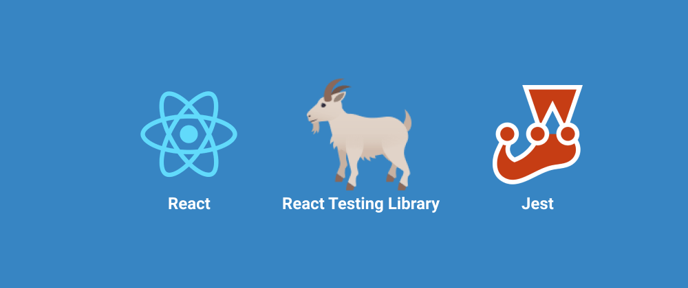

--- 

## Por quê criar testes?

A primeira pergunta que deve vir na mente de todo desenvolvedor, por que criar testes?
Se tratando de frontend então, o que mais se deve ouvir é: "Pra que criar testes
se a equipe pode testar?"

Os testes automatizatos necessitam sim de um esforço a mais quando se trata de
desenvolver um software, mas o que muitas pessoas acabam não percebendo é que
esse esforço na verdade pode economizar mais esforço e até dinheiro no futuro.

Como podemos ter tanta certeza que uma mudança X não vai quebrar features que já
estavam funcionando? Para isso existem muitos tipos de testes, nesse artigo vou
comentar sobre testes unitários e mostrar como testar sua aplicação React.

## Evite testes de detalhes da implementação!

Se tratando do React é muito comum as pessoas associarem os testes de componentes
a library `Enzyme`. Realmente é uma boa biblioteca que ajudou muitos devs a testarem
suas aplicações em React, mas com o tempo surgiram muitas controvérsias na comunidade
sobre os falsos positivos e falsos negativos que essa abordagem de teste proporciona.

Como o objetivo é testar direto o detalhe da implementação, quando acontece uma
refatoração no código os testes podem acabar falhando, gerando um falso negativo.
No caso dos falsos positivos, eles podem aparecer quando não é testado todo o
detalhe, passando bugs pelos testes.

Se quiser mais informações e exemplos recomendo 
[esse artigo](https://kentcdodds.com/blog/testing-implementation-details) do Kent C. Dodds.

## Tooling

Vou comentar rapidamente do tooling de testes recomendado hoje pro React quando se
fala em testes unitários.

[Jest](https://jestjs.io/) é um framework completo de testes pro JavaScript, podendo
ser utilizado para testar frontend web, backend, mobile e várias plataformas que
usam JS.

[Testing Library](https://testing-library.com/) é uma biblioteca com utilitários
para criar testes de comportamento(behavior) focado em boas práticas. No exemplo
vou mostrar a utilização dela no React, mas existem versões pra JS Vanilla, Vue,
React Native e outros...

